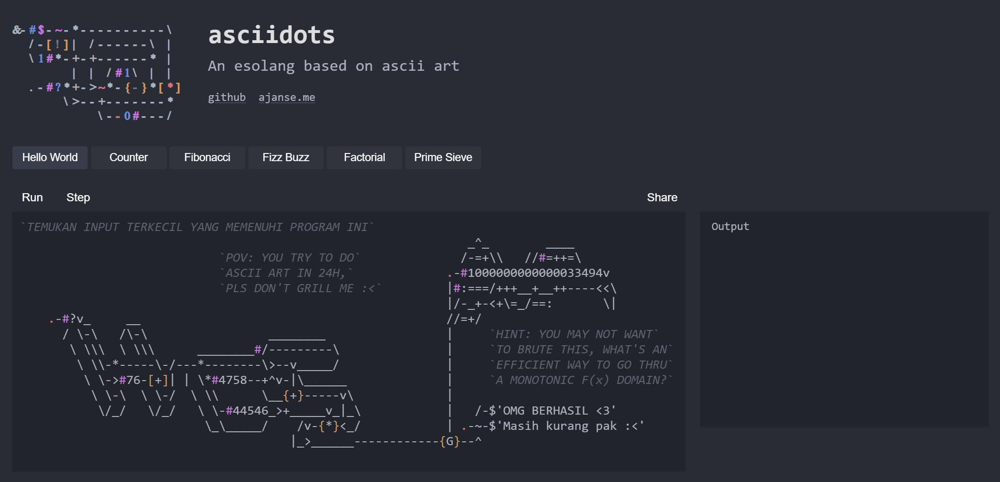

# 🥀 decodescii PoC (EN)

[[ID]](#-decodescii-poc-id)

Provided is an nc service with the background of it being some "forensics"-ish thingy where you're an agent for some security company thing.

First of all, using [CyberChef](https://gchq.github.io/CyberChef/) would help a lot here, as we're dealing with a lot of encoding and such, so having a toolkit with a lot of encodings just bunched up together could be a huge help.

## 👀 Step 1: THE WEIRD STRING...

You're given this snippet of a "hidden" message comm from one of the threat actors,

```
22 59 34 6e 6b 33 33 20 5a 33 72 30 20 46 75 6c 6c 20 35 37 30 70 20 20 35 33 76 33 6e 20 48 30 37 33 6c 20 37 68 72 33 33 20 20 4b 31 6c 30 20 37 68 72 33 33 20 59 34 6e 6b 33 33 20 20 30 6e 33 20 46 31 76 33 20 20 30 6e 33 20 37 68 72 33 33 20 30 6e 33 20 37 77 30 20 22
```

Shoving this into CyberChef would immediately trigger it suggesting that you translate it over from hex.


You'll notice that this is leetspeek,

```
"Y4nk33 Z3r0 Full 570p  53v3n H073l 7hr33  K1l0 7hr33 Y4nk33  0n3 F1v3  0n3 7hr33 0n3 7w0 "
```

if you cleaned it up with the "convert from leet speak" op from cyberchef, you'd get the cleaned up NATO alphabet string. Converted, you'll see that this gets us

```
Y0. 7h3 K3Y 15 1312
```

So that's... the key, `1312`. In retrospect, tbh if you immediately shoved this into chatgpt or some other chatbot, it shud b able to get it, this wasn't that convoluted. 🗿

## 😶 Step 2: Asset?

You're provided with this string, apparently a snippet of their latest comm, with a new cover. Apparently containing the link to a malicious binary.

```
3G4P47S44:8D7/DR44+3EEB6S44EECM9EM-DZED1Q5LQE0/DZEDT44S44+8DA44ZEDGEC3EF2LE1Q5-EDJ:4944SUEF1A TAI1AWL6A69L7BG%63M6U6AQIBXY9UTAX+9 TA8*6PTAA+84X6VX8CIA71A5X60C9DH8K+997BWYATTAYY9HX7HX7HX7Y0
```

Now, admittedly, for this one, I'd chosen an encoding that's a bit weird, I've never used it either 💀 BUT— wait, hear me out, so I knew that this was gonna take a bit, _so_, if you submitted a wrong answer, I gave this hint.

```md
# ...trunc...

Answer: eee
Hmm, doesn't seem to be a valid URL, Agent. Though, this is quite an interesting looking encoding, kinda reminds me of that... thing, back during COVID...
```

If you ask a chatbot about it, might take a few tries, but Base45 was pretty well-known for being used in COVID certificates in the EU (e.g. here's me asking gemini abt it).


Decoded, gets us

```
"w8, think som1s tappin in, sendin u the binary rq, it's at OVTWOY3GHIXS643WPFZGMLTQNZTW6YTLFZ5GE4RPON5HIMBRNMXGU4TPMM======"
```

That last bit, if you shoved it into CyberChef,


gets us `uggcf://svyrf.pngobk.zbr/szt01k.jroc`. Now, obv this isn't a normal link lol, so it's been "encrypted" in some way, likely classical considering the representation is still mostly the same charset (in fact, since you know the plaintext of "https://", you can prolly solve it manually, albeit a bit slowly). A good tool to identify and solve these types of classical stuff is [dcode.fr](https://www.dcode.fr/cipher-identifier).


ROT-13, bam, you got the link.


## 🫠 Step 3: Final Attack

Next, you're given this base64 string


Decoded, this goes to a link at `https://ajanse.me/asciidots/?code=...`

If you opened it, it'd lead to this `asciidots` page, and as the header reads, it's an esolang.



If I only provided you with just the program I feel like it'd take too long for anyone to get 💀 sooo, I gave some sprinkles of hints in there. Fwiw, this bit's probably the "hardest" thus far, but the instruction at the top left and the hint would only lead to one likely possibility: Binary Search.

Now, I'm not gonna explain to you how it works, but you can check the GIF below that illustrates how it works.


Basically, you do that, working with the signal from the asciidots code. How would you do that? Run the asciidots interpreter in your solver. See [./solver.py](./solver.py) to check out how this gets implemented.


# 🥀 decodescii PoC (ID)
