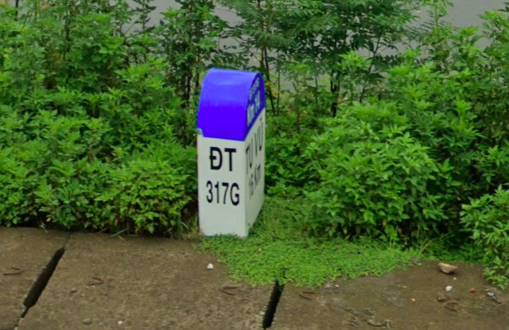
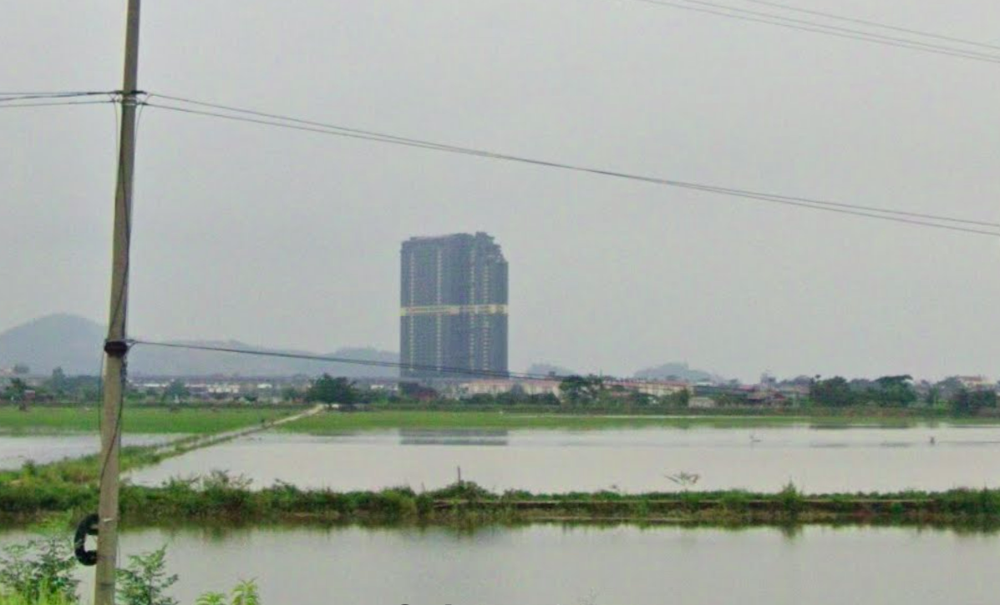
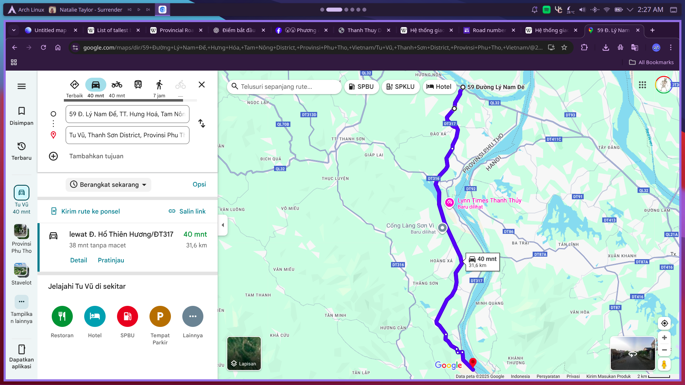
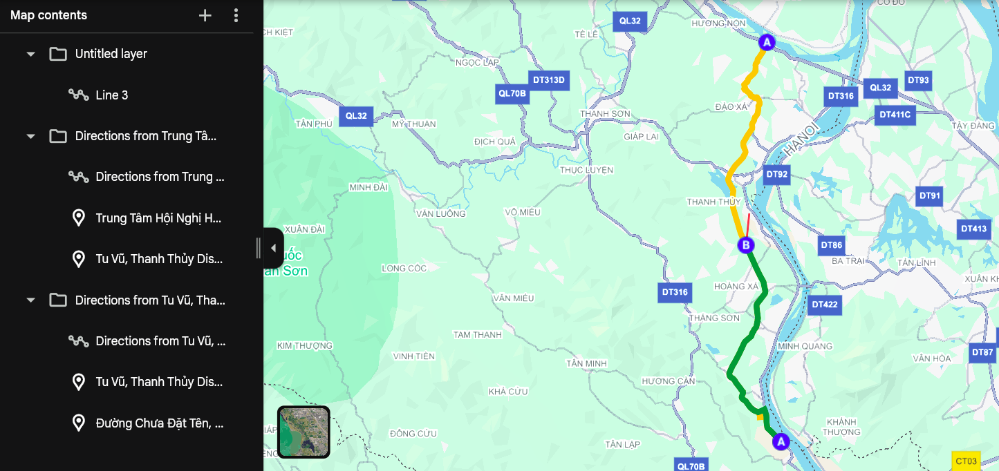

# Proof of Concept

## TL;DR
1. Ada beberapa detail yang bisa diperhatikan sebelum memulai pencarian.

2. Pada patok jalan berikut, terdapat detail berupa ĐT 317G yang merupakan provincial road dengan arah tujuan Tu Vũ. Hal tersebut merupakan petunjuk bahwa lokasinya berada di Vietnam.


3. Reverse image search bangunan berikut, maka dapat diketahui pula bangunan tersebut adalah Wyndham Lynn Times yang berada di Phú Thọ, Vietnam.


4. Refer ke https://vi.wikipedia.org/wiki/%C4%90%C6%B0%E1%BB%9Dng_t%E1%BB%89nh_317 dan beberapa source lain, ĐT 317 adalah percabangan dari QL 32 yang merupakan national road Vietnam. Menurut https://thuvienphapluat.vn/van-ban/Tai-chinh-nha-nuoc/Quyet-dinh-541-QD-UBND-2021-xep-loai-duong-tinh-de-xac-dinh-gia-cuoc-van-tai-duong-bo-Phu-Tho-477079.aspx, ĐT 317 memiliki beberapa cabang lagi. Visualisasi salah satu jalur beserta jarak tempuhnya dari titik awal sampai ke Tu Vũ kurang lebih sebagai berikut.


5. Setelah mendapat beberapa informasi tersebut, kita bisa mulai menebak lokasinya menggunakan logika. Mengingat jarak antara titik awal ĐT 317 dengan Tu Vũ adalah ±30 Km, kita bisa menebak-nebak angka yang tertulis samar-samar pada patok jalan dengan:
- ĐT 317G Km 14 yang berarti Km ke-14 di ĐT 317
- Tu Vũ 16 Km yang berarti 16 Km lagi untuk sampai ke Tu Vũ

6. Buat visualisasi dari kumpulan informasi tersebut untuk melakukan cross-refer sehingga dapat mempermudah pencarian lokasi tepat streetview.

- A Kuning ke A Hijau ±30 Km
- A Kuning ke B -> ĐT 317G Km 14 
- B ke A Hijau -> Tu Vũ 16 Km
- Garis Merah -> Pemandangan Wyndham Lynn Times dari lokasi streetview

doksli: https://maps.app.goo.gl/SZRpBML74zL3uZZg7

```
HCS{h4rd_w0rk_w1ll_p4y_y0u_0u7_4_fl4g}
```
